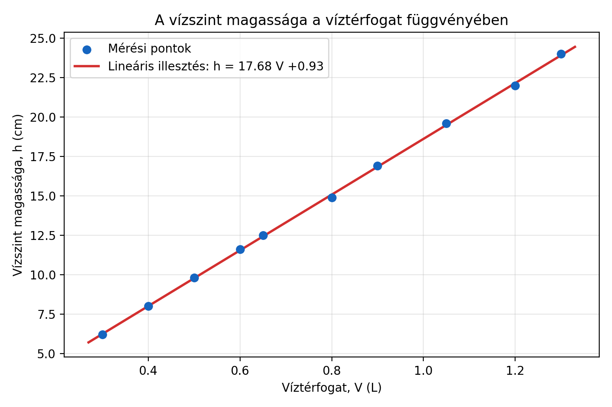

# Áramlási sebesség mérése csőben és a víz viszkozitásának meghatározása

**Fizika laboratórium 1. – Szorgalmi feladat**

| Adat | Érték |
|---|---|
| Készítette | [Név] |
| Neptun-kód | [Neptun-kód] |
| Mérőtárs | [Név / nincs] |
| Mérés dátuma | [ÉÉÉÉ.HH.NN.] |
| Beadás dátuma | [ÉÉÉÉ.HH.NN.] |
| Vállalt nehézségi szint | **[Alapszint / Haladó szint]** |

---

## Absztrakt

> **Terjedelem:** körülbelül 100–200 szó. Az absztraktban egyértelműen szerepeljen a vállalt nehézségi szint.

[Röviden ismertesd a mérés célját, az elkészített PET-palackos mérőeszközt, a kalibráció és az áramlási sebesség mérési módszerét. Add meg a vizsgált csőhosszak és nyomásértékek számát. Foglald össze, hogyan vetetted össze az eredményeket a Bernoulli–Torricelli- és a Hagen–Poiseuille-modellel. Írd le a víz mért dinamikai viszkozitását bizonytalansággal és a mérési hőmérséklettel együtt, majd egy mondatban a legfontosabb következtetést. Haladó szint esetén nevezd meg a választott kiegészítő paramétert is.]

---

## 1. Bevezetés

### 1.1 A mérés célja

A mérés céljai:

- [a kifolyási sebesség vagy térfogatáram vizsgálata a hidrosztatikai nyomás függvényében;]
- [a csőhossz áramlásra gyakorolt hatásának meghatározása;]
- [a Bernoulli–Torricelli- és Hagen–Poiseuille-modellek összevetése a mért adatokkal;]
- [a víz dinamikai viszkozitásának meghatározása;]
- [haladó szint esetén a választott további paraméter hatásának vizsgálata.]

### 1.2 Önálló kérdések és hipotézisek

1. **Nyomásfüggés:** Lamináris áramlás és megfelelően hosszú cső esetén várhatóan

   $$Q\propto \Delta p.$$

2. **Hosszfüggés:** Azonos nyomáskülönbség és csősugár mellett várhatóan

   $$Q\propto \frac{1}{L}.$$

3. **Hidraulikai ellenállás:** Várhatóan

   $$R=\frac{\Delta p}{Q}\propto L.$$

4. **Rövid csövek:** [Fogalmazd meg, miért vársz eltérést a Hagen–Poiseuille-törvénytől nagyon rövid csöveknél.]

5. **Saját kérdés:** [Például: melyik elméleti modell írja le jobban a mérési tartományt?]

6. **Haladó hipotézis:** [Csak haladó szint esetén: hőmérséklet, folyadékfajta vagy koncentráció várható hatása.]

---

## 2. Elméleti háttér

### 2.1 Hidrosztatikai nyomás

A cső középvonala és a szabad vízfelszín közötti $h$ magasságkülönbségből származó nyomáskülönbség:

$$
\Delta p=\rho gh,
$$

ahol $\rho$ a folyadék sűrűsége, $g$ a nehézségi gyorsulás. A számításokban használt értékek:

| Mennyiség | Jel | Felhasznált érték | Mértékegység | Forrás |
|---|---:|---:|---:|---|
| Nehézségi gyorsulás | $g$ | 9,81 | m/s² | [forrás] |
| Víz sűrűsége | $\rho$ | [érték] | kg/m³ | [forrás, hőmérséklet] |
| Irodalmi dinamikai viszkozitás | $\eta_\mathrm{irod}$ | [érték] | Pa·s | [forrás, hőmérséklet] |

### 2.2 Bernoulli-egyenlet és Torricelli-törvény

[Röviden ismertesd az energiamegmaradáson alapuló Bernoulli-egyenletet, az alkalmazás feltételeit és a Torricelli-törvény levezetésének lényegét.]

Ideális, veszteségmentes kifolyás esetén:

$$
v_\mathrm{ideal}=\sqrt{2gh}=\sqrt{\frac{2\Delta p}{\rho}}.
$$

Ebből $v^2\propto h$ várható. [Írd le, miért csak referencia a modell egy hosszú, keskeny cső valós áramlására.]

### 2.3 Hagen–Poiseuille-törvény

Lamináris, stacionárius, összenyomhatatlan áramlásra, hosszú, kör keresztmetszetű csőben:

$$
Q=\frac{\pi r^4}{8\eta L}\Delta p,
$$

ahol $Q$ a térfogatáram, $r$ a cső belső sugara, $L$ a cső hossza, $\eta$ pedig a dinamikai viszkozitás.

Az átlagos áramlási sebesség:

$$
v=\frac{Q}{A}=\frac{Q}{\pi r^2}.
$$

A hidraulikai ellenállás:

$$
R=\frac{\Delta p}{Q}=\frac{8\eta L}{\pi r^4}.
$$

[Ismertesd röviden a törvény alkalmazási feltételeit, az $r^4$-függés jelentőségét, valamint a belépési és kilépési veszteségek lehetséges hatását.]

### 2.4 Reynolds-szám

$$
\mathrm{Re}=\frac{\rho vd}{\eta}.
$$

[Írd le, hogyan használható a Reynolds-szám az áramlási tartomány ellenőrzésére, és milyen közelítő határérték alapján tekinted az áramlást laminárisnak.]

---

## 3. Mérőeszköz keszitese és kalibráció

### 3.1 A mérőeszköz felépítése

Annak erdekeben, hogy a kifolyasi sebesseget jobban tudjam vizsgalni igyekeztem egy jo kozelitessel hengeres palacokt vasarolni. Igy a vizszintvaltozasbol egyenesen tudtam kovetkeztetni a kifolyasi sebessegre. Egy 1.5L-es Jana PET palackra esett a valasztasom. Emellett kifolyocsonek 19,7cm hosszu szivoszalakat hasznaltam (sajnos csak papir szivoszalat tudtam szerezni). Forrasztopakaval megfelelo meretu lyukat keszitettem a PET palackba, hogy a szivoszal szorosan beferjen. A szivoszalat kicsit (kb. 1 cm-re) betoltam a palackba, hogy a meres soran stabilan a helyen maradjon. Ezutan forrasztopisztollyal beragasztottam a csatlakozast. Igy a szivoszal stabilan allt a palackban es a szivargast lehetosegeit is csokkentettem. A szivoszal kezdeti hossza a palack kulso szeletol merve 18.7mm volt.

**1. ábra – Az elkészített mérőeszköz fényképe:**

### 3.2 Kalibrációs eljárás

[Írd le lépésenként a kifolyónyílás lezárását, a vízszintek megjelölését, valamint a cső középvonalától mért $h$ magasság meghatározását. Ne a palack aljától mért magasságot használd.]

Keves vizet toltve a palackba meggyozodtem arrol, hogy a ragasztas visszafogja a vizet es nem szivarog a rendszerbol. A kalibraciot a kovetkezo keppen vegeztem: Mililiteres meroedennyel kimertem 1,3L vizet es ezt betoltottem a palackba, mikozben befogva tartottam a cso veget. Igy kezdetben a vizszint odaig ert ahol a palack nyaka elekzdett begorbulni. Ezutan rovid idore elengedtem a befogott csovet, es folyamatosan engedtem ki a vizet a palackbol az alatta talalhato meroedenybe. Amikor ujra befogtam a palack szalyat egy vonallal jeloltem a vizszintet a palackra ragasztott papirragaszton, es leolvastam a vizszintet a meroedenyen. Gyorsan visszaszamoltam a palackban levo viz terfogatat es a megfelelo jelolovonal melle felirtam. A kalibracio soran 10 meresi pontot vettem fel. A legmagasabb jelolovonal az 1,3L terfogatu vizhez tartozik. A legalso poziciot a szivoszal tetejenel vettem fel amikor mar csak csopogott a viz. Ezutan visszaszamoltam az aktualis magassagokhoz tartozo hidrosztatikai nyomast ugy, hogy a 0 szintet a szivoszal magassagahoz vettem fel.

| Jelölés | $h$ / cm | $h$ / m | $\Delta p=\rho gh$ / Pa | $\delta h$ / mm | $\delta(\Delta p)$ / Pa | Megjegyzés |
|---:|---:|---:|---:|---:|---:|---|
| 1 |  |  |  |  |  |  |
| 2 |  |  |  |  |  |  |
| 3 |  |  |  |  |  |  |
| 4 |  |  |  |  |  |  |
| 5 |  |  |  |  |  |  |
| 6 |  |  |  |  |  |  |
| 7 |  |  |  |  |  |  |
| 8 |  |  |  |  |  |  |

**3. ábra – Kalibrációs görbe, $\Delta p(h)$:**

[Add meg az illesztett egyenes egyenletét, meredekségét, bizonytalanságát és az illeszkedés minőségét. Vesd össze a meredekséget a $\rho g$ elméleti értékkel.]

---

## 4. Mérési módszer

### 4.1 A térfogatáram és az átlagsebesség mérése

[Írd le, hogy térfogatot vagy tömeget gyűjtöttél-e adott idő alatt, hogyan indítottad és állítottad le a mérést, és hogyan biztosítottad az ismételhetőséget.]

Az egyes mérésekből:

$$
h_\mathrm{átl}=\frac{h_\mathrm{kezd}+h_\mathrm{vég}}{2},
\qquad
\Delta p=\rho gh_\mathrm{átl},
$$

$$
Q=\frac{V}{t}
\quad\text{vagy tömegmérésnél}\quad
Q=\frac{m}{\rho t},
$$

$$
v=\frac{Q}{A}.
$$

### 4.2 Ismételt mérések

[Add meg, hány ismétlést végeztél egy-egy nyomásértéknél. A kiírás legalább 2–3 ismétlést kér. Írd le, hogyan kezelted a hibás vagy megismételt méréseket.]

### 4.3 A vízszint változásának kezelése

[Írd le, hogy kis térfogatot gyűjtöttél, állandó szintet tartottál, vagy a kezdő és végső vízszint átlagával számoltál.]

### 4.4 Vizsgált csőhosszak

> A kiírás legalább 10, körülbelül 5 mm és 50 cm közötti csőhosszt kér.

| Sorszám | $L$ / cm | $\delta L$ / cm | A cső állapota / megjegyzés |
|---:|---:|---:|---|
| 1 |  |  |  |
| 2 |  |  |  |
| 3 |  |  |  |
| 4 |  |  |  |
| 5 |  |  |  |
| 6 |  |  |  |
| 7 |  |  |  |
| 8 |  |  |  |
| 9 |  |  |  |
| 10 |  |  |  |

### 4.5 Környezeti és mérési körülmények

| Mennyiség | Érték | Bizonytalanság | Mértékegység |
|---|---:|---:|---:|
| Víz hőmérséklete | [érték] | [érték] | °C |
| Környezeti hőmérséklet | [érték] | [érték] | °C |
| Egyéb körülmény | [érték] | [érték] | [egység] |

---

## 5. Mérési eredmények

### 5.1 Nyomásfüggés egy választott csőhossznál

**Választott csőhossz:** $L=[\ ]$ cm.

| Nyomásszint | Ismétlés | $h_\mathrm{kezd}$ / cm | $h_\mathrm{vég}$ / cm | $h_\mathrm{átl}$ / cm | $\Delta p$ / Pa | $t$ / s | $V$ / mL vagy $m$ / g | $Q$ / mL·s⁻¹ | $v$ / m·s⁻¹ |
|---:|---:|---:|---:|---:|---:|---:|---:|---:|---:|
| 1 | 1 |  |  |  |  |  |  |  |  |
| 1 | 2 |  |  |  |  |  |  |  |  |
| 1 | 3 |  |  |  |  |  |  |  |  |
| 2 | 1 |  |  |  |  |  |  |  |  |
| 2 | 2 |  |  |  |  |  |  |  |  |
| 2 | 3 |  |  |  |  |  |  |  |  |

> A teljes mérési táblázatot szükség esetén helyezd az A függelékbe; itt az átlagolt vagy feldolgozott adatokat közöld.

**4. ábra – Térfogatáram a nyomáskülönbség függvényében:**

Az illesztett összefüggés:

$$
Q=S_L\Delta p+b,
$$

ahol $S_L=[\ ]$, $b=[\ ]$, $R^2=[\ ]$.

**5. ábra – Átlagsebesség és Torricelli-modell összehasonlítása:**

### 5.2 A csőhossz hatása

| $L$ / cm | Nyomásszint | $\overline{\Delta p}$ / Pa | $\overline{Q}$ / m³·s⁻¹ | $s_Q$ / m³·s⁻¹ | $S_L$ / m³·s⁻¹·Pa⁻¹ | $R_L=1/S_L$ / Pa·s·m⁻³ | Re |
|---:|---:|---:|---:|---:|---:|---:|---:|
|  |  |  |  |  |  |  |  |
|  |  |  |  |  |  |  |  |
|  |  |  |  |  |  |  |  |

**6. ábra – Térfogatáram $1/L$ függvényében rögzített nyomásnál:**

**7. ábra – Hidraulikai ellenállás a csőhossz függvényében:**

Az illesztett összefüggés:

$$
R_L=aL+c,
$$

ahol $a=[\ ]$, $c=[\ ]$, $R^2=[\ ]$.

### 5.3 A víz viszkozitásának meghatározása

A több csőhosszra illesztett $R_L(L)$ egyenes meredekségéből:

$$
\eta=\frac{a\pi r^4}{8}.
$$

| Meghatározási mód | $\eta$ / Pa·s | Bizonytalanság / Pa·s | Relatív bizonytalanság | Megjegyzés |
|---|---:|---:|---:|---|
| Egy választott csőhosszból |  |  |  |  |
| Több csőhossz illesztéséből |  |  |  | ajánlott végeredmény |
| Irodalmi érték $T=[\ ]$ °C-on |  |  |  | [forrás] |

A választott végeredmény:

$$
\boxed{\eta=([\ ]\pm[\ ])\ \mathrm{Pa\,s}\quad T=[\ ]\ ^\circ\mathrm{C}}
$$

Az irodalmi értéktől való relatív eltérés:

$$
\varepsilon_\mathrm{rel}=\frac{|\eta_\mathrm{mért}-\eta_\mathrm{irod}|}{\eta_\mathrm{irod}}\cdot100\%=[\ ]\%.
$$

---

## 6. Bizonytalanságszámítás és hibaforrások

### 6.1 A közvetlenül mért mennyiségek bizonytalansága

| Mennyiség | Mérőeszköz | Felbontás | Becsült bizonytalanság | Jelleg |
|---|---|---:|---:|---|
| Magasság $h$ | [eszköz] | [érték] | $\delta h=[\ ]$ | véletlen / rendszeres |
| Idő $t$ | [eszköz] | [érték] | $\delta t=[\ ]$ | véletlen / rendszeres |
| Térfogat $V$ | [eszköz] | [érték] | $\delta V=[\ ]$ | véletlen / rendszeres |
| Csőhossz $L$ | [eszköz] | [érték] | $\delta L=[\ ]$ | véletlen / rendszeres |
| Csősugár $r$ | [eszköz] | [érték] | $\delta r=[\ ]$ | véletlen / rendszeres |
| Hőmérséklet $T$ | [eszköz] | [érték] | $\delta T=[\ ]$ | véletlen / rendszeres |

### 6.2 Származtatott mennyiségek bizonytalansága

Nyomáskülönbség:

$$
\delta(\Delta p)\approx\rho g\,\delta h,
\qquad
\frac{\delta(\Delta p)}{\Delta p}\approx\frac{\delta h}{h}.
$$

Térfogatáram:

$$
\frac{\delta Q}{Q}\approx
\sqrt{\left(\frac{\delta V}{V}\right)^2+
\left(\frac{\delta t}{t}\right)^2}.
$$

Az egy csőhossz alapján számított viszkozitás közelítő relatív bizonytalansága:

$$
\frac{\delta\eta}{\eta}\approx
\sqrt{
\left(4\frac{\delta r}{r}\right)^2+
\left(\frac{\delta L}{L}\right)^2+
\left(\frac{\delta S}{S}\right)^2}.
$$

[Mutass be legalább egy konkrét bizonytalanságszámítást behelyettesített értékekkel. Emeld ki a csősugár negyedik hatványából eredő érzékenységet.]

### 6.3 Véletlen hibák

- [reakcióidő;]
- [vízszint és térfogat leolvasása;]
- [a vízsugár ingadozása;]
- [egyéb.]

[Írd le, hogyan csökkentetted vagy becsülted ezeket ismételt méréssel és szórásszámítással.]

### 6.4 Rendszeres hibák

- [a belső átmérő hibás meghatározása;]
- [szivárgás vagy légbuborék;]
- [nem vízszintes vagy deformált cső;]
- [belépési és kilépési veszteségek;]
- [mérés közbeni jelentős vízszintcsökkenés;]
- [hőmérséklet vagy sűrűség pontatlan figyelembevétele;]
- [egyéb.]

[Becsüld meg, hogy melyik hibaforrás dominálhatta a végeredményt, és milyen irányban torzíthatta azt.]

---

## 7. Értékelés és diszkusszió

### 7.1 Nyomásfüggés

[Értékeld, hogy a $Q(\Delta p)$ kapcsolat mennyire lineáris. Vesd össze a Poiseuille-féle $Q\propto\Delta p$ és a Torricelli-féle $v\propto\sqrt{\Delta p}$ várakozást. Hivatkozz az ábrákra és az illesztési mutatókra.]

### 7.2 Hosszfüggés

[Értékeld a $Q\propto1/L$ és az $R\propto L$ összefüggéseket. Térj ki a legrövidebb csövek esetleges eltérésére és a tengelymetszet fizikai jelentésére.]

### 7.3 Az áramlási tartomány

[A számított Reynolds-számok alapján döntsd el, hogy teljesülhetett-e a lamináris áramlás feltétele. Tárgyald az esetleges átmeneti vagy turbulens pontokat.]

### 7.4 A viszkozitás összevetése irodalmi adattal

[Vesd össze a mért és irodalmi értéket azonos vagy korrigált hőmérsékleten. Állapítsd meg, hogy az eltérés összhangban van-e a becsült bizonytalansággal.]

### 7.5 A mérés korlátai és továbbfejlesztése

[Írd le, mit változtatnál a mérőeszközön, a mérési protokollon vagy az adatfeldolgozáson egy pontosabb ismétléshez.]

---

## 8. Haladó szintű kiegészítő mérés

> **Csak haladó szint esetén maradjon a jegyzőkönyvben.** Válassz egyet: különböző folyadékok, különböző koncentrációk vagy különböző vízhőmérsékletek.

### 8.1 A kiegészítő vizsgálat célja és elméleti várakozása

**Választott paraméter:** [hőmérséklet / folyadékfajta / koncentráció]

[Fogalmazd meg az önálló kérdést, az elméleti várakozást és az összehasonlításhoz használt irodalmi adatokat.]

### 8.2 Mérési módszer

[Írd le, mely változókat tartottad állandóan, melyiket változtattad, hány pontot és ismétlést mértél.]

### 8.3 Eredmények

| Paraméter értéke | $T$ / °C | $\Delta p$ / Pa | $L$ / cm | $\overline Q$ / m³·s⁻¹ | $\eta$ / Pa·s | Bizonytalanság |
|---:|---:|---:|---:|---:|---:|---:|
|  |  |  |  |  |  |  |
|  |  |  |  |  |  |  |
|  |  |  |  |  |  |  |

**8. ábra – A kiegészítő paraméter hatása:**

### 8.4 Értékelés

[Vesd össze az eredményeket az elméleti várakozással és irodalmi adatokkal. Tárgyald a bizonytalanságokat és a lehetséges rendszeres hibákat.]

---

## 9. Következtetések

[Tömören, számszerűen válaszolj a mérés célkitűzéseire és a hipotézisekre. Add meg a végső viszkozitást bizonytalansággal és hőmérséklettel. Írd le, melyik modell írta le jobban az adatokat, hogyan függött az áramlás a nyomástól és a csőhossztól, valamint mi volt a mérés legfontosabb korlátja. Ne vezess be itt új adatot vagy ábrát.]

---

## Irodalomjegyzék

1. [A laborfeladat hivatalos kiírása: pontos cím, intézmény, év.]
2. [Bernoulli-törvényhez használt tankönyv vagy megbízható forrás.]
3. [Hagen–Poiseuille-törvényhez használt tankönyv vagy megbízható forrás.]
4. [A víz sűrűségének és viszkozitásának hőmérsékletfüggő irodalmi adata.]
5. [További felhasznált források.]
6. [A vizespalack fotoja](https://italtmost.hu/termek/uditok/asvanyviz-izesitett-viz/jana-15l-citrom-limetta/)

> Minden internetes forrásnál add meg a szerzőt vagy intézményt, a címet, az URL-t és a megtekintés dátumát.

---

## Függelékek

### A. Teljes nyers mérési adatsor

| $L$ / cm | Nyomásszint | Ismétlés | $h_\mathrm{kezd}$ / cm | $h_\mathrm{vég}$ / cm | $t$ / s | $V$ / mL vagy $m$ / g | Megjegyzés |
|---:|---:|---:|---:|---:|---:|---:|---|
|  |  |  |  |  |  |  |  |

### B. Mintaszámítások

[Mutasd be legalább egy mérési pont teljes feldolgozását: $h_\mathrm{átl}$, $\Delta p$, $Q$, $v$, $R$ és Re.]

### C. Illesztési eredmények

[Közöld az illesztések paramétereit, bizonytalanságait, reziduumait vagy a feldolgozó program releváns kimenetét.]

### D. Fénykép- és videódokumentáció

| Azonosító | Fájl neve | Tartalom | Kapcsolódó mérés |
|---|---|---|---|
| F1 | [fájlnév] | [leírás] | [mérés] |
| F2 | [fájlnév] | [leírás] | [mérés] |
| V1 | [fájlnév] | [leírás] | [mérés] |

---

## Beadás előtti ellenőrzőlista

- [ ] Az absztrakt megnevezi az alapszintet vagy a haladó szintet.
- [ ] A Bernoulli–Torricelli- és Hagen–Poiseuille-elmélet röviden szerepel.
- [ ] A mérőeszköz készítése és szivárgásvizsgálata dokumentált.
- [ ] A kalibrációs eljárás, táblázat és ábra szerepel.
- [ ] A cső belső átmérője és annak bizonytalansága szerepel.
- [ ] Egy csőhossznál több nyomásérték és nyomásonként legalább 2–3 ismétlés szerepel.
- [ ] Legalább 10 különböző, 5 mm és 50 cm közötti csőhossz szerepel.
- [ ] A $Q$, $v$, $\Delta p$, $R$ és Re számítása megtörtént.
- [ ] Az ábrák tengelyfelirata, mértékegysége, jelmagyarázata és illesztése megfelelő.
- [ ] A víz viszkozitása illesztésből, bizonytalansággal együtt szerepel.
- [ ] A mért viszkozitás össze van vetve a mért hőmérséklethez tartozó irodalmi értékkel.
- [ ] A véletlen és rendszeres hibák értékelése szerepel.
- [ ] A következtetések konkrét mérési adatokkal vannak alátámasztva.
- [ ] A teljes nyers adatsor a függelékben szerepel.
- [ ] A fénykép- vagy videódokumentáció csatolva van.
- [ ] A végleges jegyzőkönyv PDF-formátumban elkészült.
